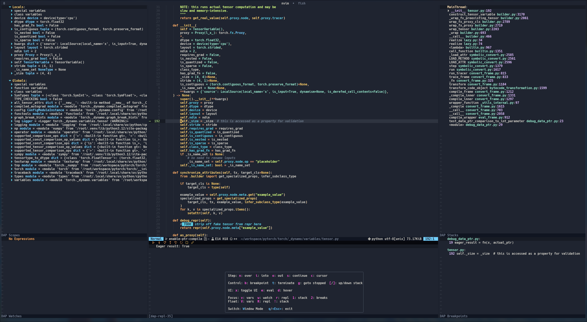

<div align="center">

# 🚀 PyTorch Development Neovim Configuration

**A production-ready Neovim setup for mixed-mode C++/Python debugging and deep learning development**

[Features](#-features) • [Installation](#-installation) • [Debugging](#-debugging-workflows) • [Keybindings](#-keybindings) • [Documentation](#-documentation)



</div>

---

## 📖 Overview

This is a complete Neovim configuration built specifically for **PyTorch development** and **mixed-mode C++/Python debugging**. Whether you're working on PyTorch internals, building custom C++ extensions, or developing pybind11 bindings, this setup provides seamless navigation and debugging across both languages.

Built on [Kickstart.nvim](https://github.com/nvim-lua/kickstart.nvim) and enhanced with professional tooling for deep learning systems work.

### Why This Configuration?

- 🔍 **Seamlessly debug Python → C++** - Step from Python code directly into C++ extensions
- ⚡ **Fast & Modern** - Optimized completion, LSP, and treesitter for instant feedback
- 🎯 **PyTorch-Optimized** - Pre-configured for PyTorch source code, extensions, and operators
- 🛠️ **Batteries Included** - All tools pre-configured: LSP, DAP, formatters, linters
- 🧩 **Extensible** - Clean Lua configuration that's easy to customize

## ✨ Features

### 🔥 Mixed-Mode Debugging

<table>
<tr>
<td width="50%">

**Python Debugging**
- Full DAP integration with debugpy
- Visual debug UI with variables, watches, and stack
- Breakpoints, conditional breakpoints, logpoints
- Expression evaluation and REPL

</td>
<td width="50%">

**C++ Debugging**
- LLDB backend via codelldb
- Attach to running Python processes
- Inspect C++ tensors and data structures
- Mixed Python/C++ stack traces

</td>
</tr>
</table>

### 🧠 Language Intelligence

| Language | LSP | Features |
|----------|-----|----------|
| **Python** | pyright | Type checking, intelligent completion, import resolution, refactoring |
| **C++** | clangd | Semantic indexing, cross-file navigation, code actions, IntelliSense |
| **Additional** | Treesitter | Advanced syntax highlighting for C, C++, Python, CMake, CUDA, JSON, TOML, Markdown |

### 🎨 Developer Experience

- **🔍 Navigation** - Telescope fuzzy finder, Flash jump labels, Harpoon file bookmarks
- **📝 Completion** - blink.cmp for blazing-fast completions
- **🎯 Code Actions** - Automated refactoring, imports, and fixes
- **🔄 Git Integration** - Inline hunks, blame, staging, and diffview
- **🪟 Session Management** - Automatic session persistence across restarts
- **🖥️ Tmux Integration** - Seamless navigation between Neovim and tmux panes

## 🚀 Installation

### Prerequisites

- Neovim >= 0.10.0
- Git
- A C++ compiler (for building extensions)
- Python >= 3.8
- Node.js (for some LSP servers)

### Quick Start

```bash
# Backup any existing configuration
mv ~/.config/nvim ~/.config/nvim.backup-$(date +%Y%m%d) 2>/dev/null || true

# Clone this repository
git clone https://github.com/hinriksnaer/nvim ~/.config/nvim

# Start Neovim - plugins will install automatically
nvim
```

### Post-Installation

1. Wait for all plugins to install automatically
2. Run `:Mason` to verify language servers are installed
3. Run `:LspInfo` to confirm LSPs are attached
4. Run `:checkhealth` to verify everything is working

## 🐛 Debugging Workflows

### Python → C++ Debugging

This configuration excels at debugging PyTorch development scenarios:

```python
# Example: Debugging a custom PyTorch operator

# 1. Set a breakpoint in your Python test
def test_custom_op():
    x = torch.randn(10, 10)
    y = my_custom_op(x)  # ← Set breakpoint here

# 2. Press <leader>ds to start debugging
# 3. Step through Python code
# 4. When you hit the C++ extension call:
#    - Press <F8> to attach codelldb
#    - Step into C++ implementation
#    - Inspect tensors at C++ level
```

### Supported Workflows

| Workflow | Description |
|----------|-------------|
| **Python → C++** | Start in Python, step into pybind11/C API calls |
| **PyTorch Operators** | Debug Python tests, inspect ATen/C++ kernels |
| **Standalone C++** | Launch native binaries, debug libtorch apps |
| **Attach to Process** | Attach to running Python processes with C++ extensions |

### Debug UI

- **Automatic Layout** - Debug UI opens on start, closes on exit
- **Variable Inspection** - Watch expressions, scopes, and hover values
- **Stack Navigation** - Navigate Python and C++ frames seamlessly
- **Breakpoint Management** - Visual breakpoint indicators and conditional breakpoints

## ⌨️ Keybindings

### Navigation

| Key | Action |
|-----|--------|
| `<leader>ff` | Find files |
| `<leader>fg` | Live grep (search in files) |
| `<leader>fb` | Browse open buffers |
| `<leader>fs` | Search word under cursor |
| `<leader>ft` | Theme picker |
| `<C-h/j/k/l>` | Navigate windows (tmux-aware) |
| `s` | Flash jump to any visible location |

### LSP & Code Intelligence

| Key | Action |
|-----|--------|
| `gd` | Go to definition |
| `gr` | Find references |
| `K` | Hover documentation |
| `<leader>ca` | Code actions |
| `<leader>cn` | Rename symbol |
| `<leader>cf` | Format buffer |
| `[d` / `]d` | Previous/next diagnostic |

### Debugging

| Key | Action |
|-----|--------|
| `<leader>ds` | Start/continue debugging |
| `<leader>db` | Toggle breakpoint |
| `<leader>dn` | Step over |
| `<leader>di` | Step into |
| `<leader>du` | Step out |
| `<leader>dx` | Toggle DAP UI |
| `<leader>de` | Evaluate expression (visual mode) |

### Git

| Key | Action |
|-----|--------|
| `<leader>gs` | Stage hunk |
| `<leader>gr` | Reset hunk |
| `<leader>gb` | Blame line |
| `<leader>gD` | Open diffview |
| `<leader>gh` | File history |
| `<leader>gtb` | Toggle blame line |

### Buffers & Windows

| Key | Action |
|-----|--------|
| `<leader>wv` | Split vertically |
| `<leader>ws` | Split horizontally |
| `<leader>wc` | Close window |
| `<leader>we` | Equalize windows |
| `<leader>bd` | Delete buffer |
| `<leader><leader>` | Switch to alternate buffer |

> **Tip**: Press `<leader>?` to see all available keybindings with which-key

## 🔧 Customization

The configuration is organized into modular files:

```
~/.config/nvim/
├── init.lua              # Entry point
├── lua/
│   ├── core/            # Core Neovim settings
│   ├── plugins/         # Plugin configurations
│   └── keymaps.lua      # Keybinding definitions
```

To customize, edit the relevant files and restart Neovim. All plugin configurations use lazy.nvim for fast startup times.

## 🐛 Troubleshooting

### LSP not working

```vim
:LspInfo          " Check server status
:Mason            " Install missing tools
:checkhealth lsp  " Diagnose LSP issues
```

### Debugger not starting

- Verify `codelldb` and `debugpy` are installed via `:Mason`
- Check DAP configuration points to the correct program
- Review `:messages` for error logs

### Formatter not running

- Ensure formatter is installed (clang-format, black, etc.)
- Check for project config files (`.clang-format`, `pyproject.toml`)
- Verify format-on-save is enabled in your settings

### Performance issues

```vim
:Lazy profile     " Check plugin load times
:checkhealth      " Run comprehensive health check
```

## 📚 Documentation

- **Which-key**: Press `<leader>?` to discover keybindings
- **Telescope**: Press `<leader>fh` to search help tags
- **Mason**: Run `:Mason` to manage LSP servers and tools

## 🤝 Contributing

Contributions are welcome! If you have improvements or bug fixes:

1. Fork the repository
2. Create a feature branch (`git checkout -b feature/amazing-feature`)
3. Commit your changes (`git commit -m 'Add amazing feature'`)
4. Push to the branch (`git push origin feature/amazing-feature`)
5. Open a Pull Request

## 📝 License

MIT License - see [LICENSE.md](LICENSE.md) for details.

## 🙏 Acknowledgments

- Built on [Kickstart.nvim](https://github.com/nvim-lua/kickstart.nvim)
- Inspired by the PyTorch development workflow
- Thanks to the Neovim community for amazing plugins

---

<div align="center">

**[⬆ Back to Top](#-pytorch-development-neovim-configuration)**

Made with ❤️ for the PyTorch community

</div>
